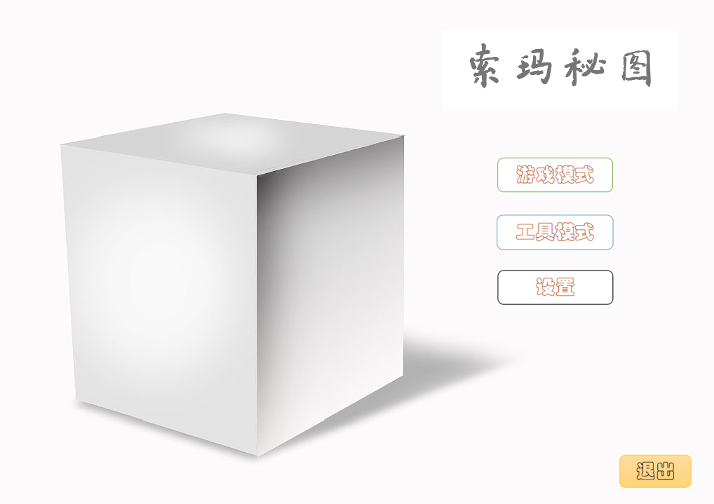
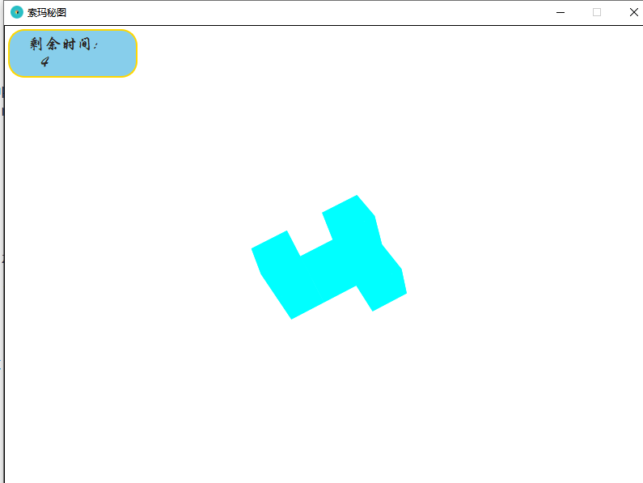
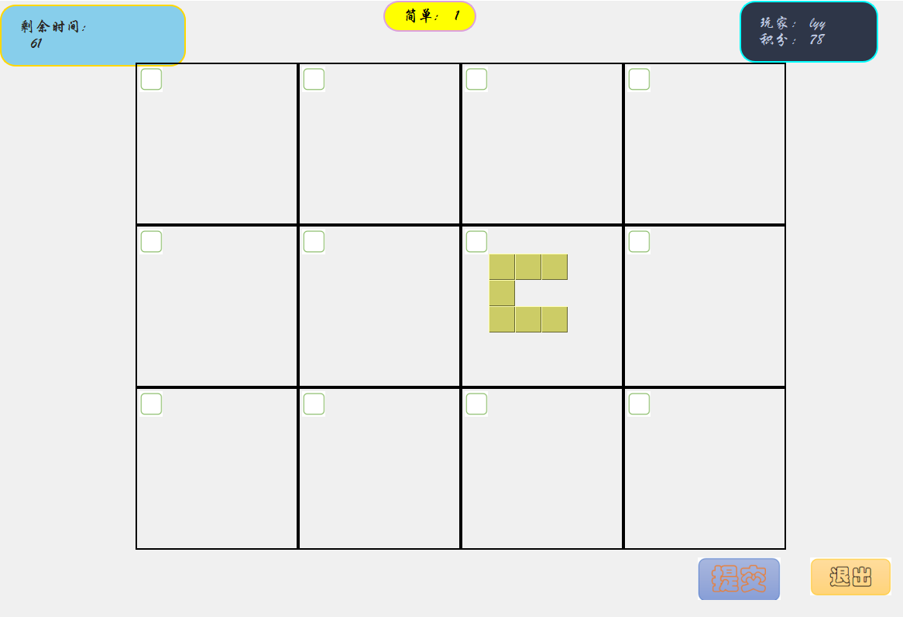
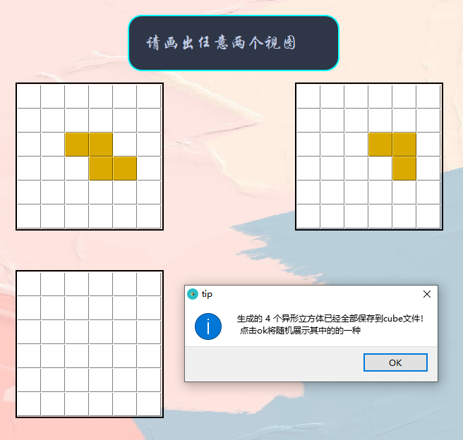
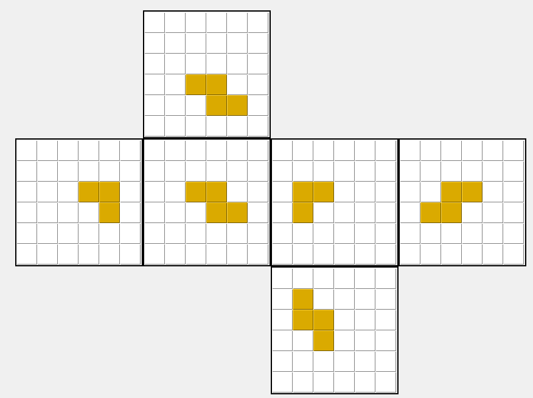
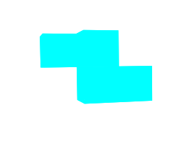
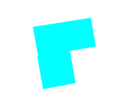

# Soma Cube

## Background

Soma Cube is a big cube consisting of small cubes with at least one face adjacent to each other stacking together.
I write a game based on it inspired by the talent show "The Brain".
<figure class="half">
  
</figure>

### Game mode

The Soma Cube Puzzle Game rule
: Given a certain amount of time to observe and memorize a Soma Cube(players can rotate, zoom in/out), 
after that players are asked to find out the three views of the Soma Cube among lots of disturbing views.

### Tool mode

Given two views, find all the possible Soma Cubes and draw the expanded view of the Soma Cube.

  
  
  
  

## Key points of the implementation

1. Small cubes are adjacent to each other through at least one face  → BFS
2. Visualization and user interaction  → Computer Graphics
3. Given two views, find all the possible Soma Cubes → DFS
